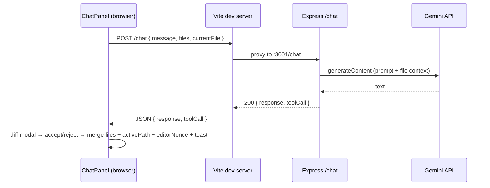

# Fullstack project (Express + Vite React)

This repo is a small **JavaScript** (no TypeScript) fullstack setup:

| Part   | Path      | Stack                          | Default URL              |
|--------|-----------|--------------------------------|--------------------------|
| API    | `server/` | Node.js, Express, ES modules  | http://localhost:3001    |
| UI     | `client/` | React 19, Vite 6, Monaco, **lucide-react** icons | http://localhost:5173    |

**Frontend UI:** **Cursor-inspired** dark workspace — layered backgrounds, **lucide-react** icons, smooth **CSS motion** (messages, file list, typing dots, toasts), **Explorer** (per-type file icons, right-click file menu, active row highlight), **Monaco** center, **AI Chat** (avatar rows + composer). The browser tab uses an **SVG favicon** (`public/favicon.svg`). **`edit_file`** opens a **side-by-side diff preview** before saving; after accept, Monaco **`editorNonce`** updates and a toast names the file (**File updated by AI:** plus the path — see [Assistant reply format](#assistant-reply-format-tool-calls)).

**Google Gemini (server):** chat is implemented in `server/services/geminiService.js` using `@google/generative-ai` and model **`gemini-2.5-flash`** (see `MODEL_NAME` in that file). The API key is read from **`GEMINI_API_KEY`** (never commit the real key).

---

## What I (the agent) need for future tasks

When you ask for changes, it helps to specify:

1. **Which side** — `server`, `client`, or both.
2. **Goal** — feature, bug, refactor, or deployment target.
3. **API contract** — if adding endpoints: method, path, request/response shape, auth.
4. **Env** — Node version if not default LTS; any secrets via `.env` (never commit real secrets).
5. **Ports** — if you change `3001` / `5173`, say so (CORS + Vite proxy must stay aligned).
6. **Gemini** — for chat or model changes: confirm `GEMINI_API_KEY` in the server environment and desired model name (see `MODEL_NAME` in `server/services/geminiService.js`).
7. **Monaco / layout / UI** — `CodeEditor.jsx`, **`App.css`** / **`index.css`** tokens, **`lucide-react`** icons, **`index.html`** / **`public/favicon.svg`**, `vite.config.js` (Monaco plugin).
8. **Virtual files** — state lives in `App.jsx` (`workspace.files` map); no persistence unless you add it. **Workspace undo / redo** (top bar) keep in-memory stacks of snapshots (see [In-memory workspace files](#in-memory-workspace-files)).
9. **Assistant tool JSON** — if changing the `edit_file` contract, update **`server/assistantOutput.js`**, **`server/services/geminiService.js`** (prompt + **`RESPONSE_FORMAT_RULES`**), **`ChatPanel`**, **`App.jsx`** (`applyAiFileEdit`, **`AiEditPreviewModal`**, toast, **`editorNonce`**), **`CodeEditor`**, and this README.

---

## Prerequisites

- **Node.js** 18+ recommended (Express + Vite 6; `--watch` on the server needs a recent Node).

---

## First-time setup

From the **repository root** (`llm/`):

```powershell
npm install
npm install --prefix server
npm install --prefix client
```

Or one shot:

```powershell
npm run install:all
```

**Gemini API key (local file):** copy `server/.env.example` to **`server/.env`**, then set `GEMINI_API_KEY=` to your key. **`server/.env` is gitignored** (see repo root `.gitignore`). The server loads it automatically via **`server/env.js`** and **`dotenv`** on startup (path is always next to `index.js`, regardless of current working directory).

---

## Development (both apps)

From the **repository root**:

```powershell
npm run dev
```

This runs **Express** and **Vite** together via `concurrently`.

- Open the UI: http://localhost:5173  
- API base (direct): http://localhost:3001  
- In dev, the browser can call **`/api/...`** and **`POST /chat`** on the Vite dev server; Vite **proxies** those paths to Express (see `client/vite.config.js`).

**Gemini:** set `GEMINI_API_KEY` in **`server/.env`** (see [Environment variables](#environment-variables)) or in the shell before `npm run dev` / `npm run dev:server`.

**Explorer / editor:** use **New file** to add `untitled-N.js` entries. Click a file to open it in Monaco; edits update **`workspace.files[path]`** in React state immediately (no disk, no DB). **Undo** / **Redo** in the top bar walk **workspace snapshots** (all files + **`activePath`**): **Undo** restores the state before your last captured action (or before the current **typing burst** on the open file — see table below). **Redo** reapplies a state you had undone until you make a new edit (which clears the redo branch). **Delete** removes a file from the map; if it was open, **`activePath`** becomes another file or **`null`** (empty read-only editor). **Rename** keeps content under a new key and updates **`activePath`** when the renamed file was focused. Names must be non-empty, at most **1024** characters, and cannot contain **`/`** or **`\`**; duplicates are rejected. Refreshing the page resets to the default **`main.js`** starter and clears both stacks.

**Chat in the UI:** **`POST /chat`** sends **`files`**, **`currentFile`**, and **`message`**. On **`edit_file`**, a **Monaco diff modal** shows **original vs proposed** text; **Accept** runs the same apply path as before (undo snapshot, workspace update, **`editorNonce`**, toast). **Reject** or **Escape** closes the dialog without changes. While the diff is open, the composer is disabled. Set **`GEMINI_API_KEY`** in **`server/.env`**.

### Run one side only

```powershell
npm run dev:server
npm run dev:client
```

---

## Production-ish flow

1. Build the client:

   ```powershell
   npm run build
   ```

   Output: `client/dist/`

2. Start the API (no hot reload):

   ```powershell
   npm start
   ```

Serving the built SPA from Express is **not** wired yet; say if you want `express.static` for `client/dist` and a catch-all for SPA routing.

**Monaco production build:** `npm run build` emits worker bundles under **`client/dist/monacoeditorwork/`** (path controlled by `vite-plugin-monaco-editor`). If you deploy only `client/dist`, include that folder and keep the same URL structure relative to `index.html`.

---

## Frontend (client)

| Piece | Role |
|--------|------|
| `index.html`, `public/favicon.svg` | **Tab favicon** — vector SVG (dark editor window + code brackets); `<link rel="icon" type="image/svg+xml" href="/favicon.svg">`; Vite serves `public/` at `/` |
| `src/App.jsx` | Workspace + **topbar** (**Undo** / **Redo**); **`applyAiFileEdit`** after diff **Accept**; **`AiEditPreviewModal`** for AI changes; **`editorNonce`**, **`.ai-toast`** |
| `src/components/FileExplorer.jsx` | File list + **New file**; **lucide** icons by type (code, JSON, text, images, shell, `.env`, YAML, …); row **hover / active** (accent rail); **right‑click** context menu (**Rename** / **Delete**) portaled to `document.body`; inline rename + row icon buttons |
| `src/components/CodeEditor.jsx` | **Monaco** — `key` uses **`path`** + **`editorNonce`**; `language` from extension (`.js`, `.json`, `.css`, …) |
| `src/components/AiEditPreviewModal.jsx` | **Monaco `DiffEditor`** (read-only, side-by-side) + **Accept** / **Reject**; **Escape** rejects; backdrop dismiss |
| `src/components/ChatPanel.jsx` | **Cursor-style** thread; **`POST /chat`** + **`onAiEditProposal`**; explains diff step when **`edit_file`** returns |

### Chat UI and backend



| Step | Detail |
|------|--------|
| 1 | User submits text; UI immediately shows a **user** row (avatar + bubble). |
| 2 | `POST /chat` with body **`{ "message": string, "files"?: object, "currentFile"?: string \| null }`**. The UI always sends **`files`** (full workspace map) and **`currentFile`** (active editor tab, or `null`). |
| 3 | On **200**, body has **`response`** (string, may be `""`) and **`toolCall`** (`null` or object). |
| 4 | If **`toolCall.action === "edit_file"`**, **`onAiEditProposal`** opens **`AiEditPreviewModal`** (original vs new). **Accept** applies **`files[filename]`**, sets **`activePath`**, bumps **`editorNonce`**, shows **File updated by AI:** toast. **Reject** discards. The chat bubble explains the diff step. |
| 5 | On error (non-OK or network), UI shows **Error** with `detail` / `error` from JSON when present. |
| 6 | In dev, **`client/vite.config.js`** proxies **`/chat`** → `http://localhost:3001/chat` (same path). |

**Styles:** `src/App.css` (workspace, **Cursor-style** chat thread + composer, explorer + **context menu**, **AI diff preview overlay**, motion keyframes, **`.ai-toast`**), `src/index.css` (dark tokens, **body radial glow**, **`prefers-reduced-motion`** overrides).

**Dependencies (notable):**

- `lucide-react` — icons (explorer file types, pane headers, chat avatars, send **ArrowUp**, brand **PanelsTopLeft** / **Sparkles**)
- `@monaco-editor/react` — React wrapper for Monaco
- `monaco-editor` — editor engine (peer to the wrapper)
- `vite-plugin-monaco-editor` (**devDependency**) — wires Monaco workers for Vite; in `vite.config.js` the plugin is loaded with **`monacoEditorModule.default ?? monacoEditorModule`** because the package is CJS and Vite’s ESM interop may not expose `default` as a callable.

**Production note:** `vite preview` or a static host must proxy **`/chat`** to your API or use a full API URL — the code uses a **relative** `/chat` URL.

**Layout:** fixed left width (`--width-explorer`: **244px**), flexible center editor, fixed right width (`--width-chat`: **384px**), full viewport height. **Accessibility:** chat input has a visually hidden label; message list uses `role="log"` / `aria-live="polite"`.

### In-memory workspace files

| Concept | Implementation |
|---------|----------------|
| Storage | `useState` in **`src/App.jsx`**: `files` is a plain object **`{ [filename]: string }`**. |
| Create | **New file** → next free name `untitled-1.js`, `untitled-2.js`, … with starter body `// New file\n`. |
| Select | Clicking a file sets **`activePath`**; explorer highlights the active file (`aria-current="true"`). |
| Delete | **`handleDeleteFile`** (after confirm): removes the key from **`files`**; if **`activePath`** was that file, switches to the first remaining path (sorted) or **`null`**; bumps **`editorNonce`** so Monaco clears when nothing is open. |
| Rename | **`handleRenameFile(old, next)`** (via **`workspaceRef`** for latest keys): copies content to **`next`**, removes **`old`**; if **`activePath === old`**, sets **`activePath`** to **`next`**. Validation: trimmed non-empty name, max length **1024**, no **`/`** or **`\`**, no duplicate keys; same name is a no-op success. |
| Editor | Monaco **`value`** is **`files[activePath]`** (or empty when **`activePath`** is **`null`**); **`onChange`** writes back into **`files[activePath]`** when a file is open (live “save” in RAM). |
| Language | **`languageFromFilename()`** in `App.jsx` maps extension → Monaco language (unknown → `plaintext`). |
| Remount | **`CodeEditor`** uses **`key={\`${path}:${editorNonce}\`}`**: changing tabs changes **`path`**; after an **accepted** AI **`edit_file`**, **delete**, **rename**, **workspace undo/redo**, or similar, **`App`** may increment **`editorNonce`** so Monaco shows the new **`content`** or empty state. |
| Undo / redo | Top-bar **Undo** pops the last snapshot from an undo stack (max **40** entries); the **current** workspace is pushed onto a **redo** stack first. **Redo** pops from redo (after pushing current onto undo). A snapshot is **`{ files, activePath }`** (shallow-cloned file map). Snapshots are pushed onto **undo** **before**: each **accepted** AI **`edit_file`**, **delete**, **rename**, **New file**, and the **first** Monaco content change on the current file after switching tabs or any of those operations — and **redo is cleared** whenever a new snapshot is captured (standard branch behavior). **Manual typing** on one file without switching only creates **one** undo entry for the whole burst (first keystroke captures pre-edit state). **Reload** clears both stacks. |

The **Chat** panel passes **`files`** (every path → content string, including empty files) and **`currentFile`** on each **`POST /chat`**. **`geminiService.js`** turns that into a prompt with a **sorted project file list**, the **active file name**, **current file content first**, then other files (subject to size limits). When the model returns **`edit_file`**, **`App.jsx`** opens **`AiEditPreviewModal`**; the workspace updates only after **Accept** (toast + **`editorNonce`** as before).

Data is **not** sent to the server except through **chat** (and other API calls you add); **reload** restores only **`DEFAULT_FILES`** (`main.js`). Monaco also has its **own** buffer undo/redo (**Ctrl+Z** / **Ctrl+Y** inside the editor); that is separate from **workspace** undo/redo in the top bar.

---

## Environment variables

Values can be set in **`server/.env`** (recommended for local dev) or in the process environment (CI/production).

| Variable          | Where   | Default                 | Purpose                                      |
|-------------------|---------|-------------------------|----------------------------------------------|
| `PORT`            | server  | `3001`                  | API listen port                              |
| `CLIENT_ORIGIN`   | server  | `http://localhost:5173` | CORS allowed origin                          |
| `GEMINI_API_KEY`  | server  | _(see `server/.env`)_   | Google AI Studio / Gemini API key            |

**Files:**

| File | Git | Purpose |
|------|-----|--------|
| `server/.env` | **Ignored** — never commit | Your real `GEMINI_API_KEY` and optional overrides |
| `server/.env.example` | Tracked | Template; copy to `.env` and fill in |

**Loading:** `server/index.js` imports **`./env.js` first**; `env.js` calls `dotenv.config({ path: join(__dirname, ".env") })` so **`server/.env`** is always read from the server package directory.

Example (PowerShell) without a `.env` file — still works for one-off runs:

```powershell
$env:PORT = "4000"; $env:CLIENT_ORIGIN = "http://localhost:5173"; npm run dev:server
```

```powershell
$env:GEMINI_API_KEY = "<your-key>"; npm run dev:server
```

If you change the Vite port, set `CLIENT_ORIGIN` in `server/.env` (or the shell) to match.

---

## API routes (current)

| Method | Path           | Response example                                      |
|--------|----------------|-------------------------------------------------------|
| GET    | `/api/health`  | `{ "ok": true, "service": "express", "timestamp": … }` |
| GET    | `/api/hello`   | `{ "message": "Hello from the Express API" }`       |
| POST   | `/chat`        | Success: `{ "response": string, "toolCall": null \| { "action":"edit_file", "filename", "content" } }` — see below |

### `POST /chat` (Gemini + workspace context)

- **URL (via Vite dev server):** `http://localhost:5173/chat` (proxied to Express).  
- **URL (direct to API):** `http://localhost:3001/chat`
- **Headers:** `Content-Type: application/json` (body limit **4 MB** on the server for large workspaces)
- **Body (JSON):**
  - **`message`** (required): non-empty string — the user’s question or instruction.
  - **`files`** (optional): object whose keys are file paths (strings) and values are file contents (strings). Max **200** files; path length max **1024** chars per key.
  - **`currentFile`** (optional): string or `null` — which file is focused in the editor. The Gemini prompt always states this path and sends that file’s body **first** (when it exists in **`files`**).
- **Prompt (Gemini):** If there is at least one file key **or** **`currentFile`** is non-empty, **`geminiService.js`** builds a multi-section prompt: **project file list** (comma-separated paths), **active editor filename**, **current file full content** (with explicit `Filename:` line), then **other workspace files** each with a `Filename:` line. Empty file bodies are still included. Soft caps: total **`MAX_CONTEXT_CHARS`** and per-file **`MAX_FILE_CHARS`** (truncation markers in the prompt). If there are no file keys **and** **`currentFile`** is null or blank, only the user message and format rules are sent.
- **Success (200):** JSON body:
  - **`response`** (string): plain-text assistant message. May be empty when only a tool call is returned.
  - **`toolCall`** (`null` or object): when present and valid, describes a machine-readable action for the client.

The model is instructed (see **`RESPONSE_FORMAT_RULES`** in `server/services/geminiService.js`) to answer in **plain text** or, to replace a whole file, output **only** a JSON object (optionally wrapped in a single fenced markdown code block tagged `json`) of the form:

```json
{ "action": "edit_file", "filename": "<path>", "content": "<full new file text>" }
```

The server parses this with **`parseAssistantModelOutput`** in **`server/assistantOutput.js`**: if the trimmed output parses as JSON with **`action === "edit_file"`** and string **`filename`** / **`content`**, the API returns that object as **`toolCall`** and sets **`response`** to `""` unless you later extend the parser to support mixed content.

### Assistant reply format (tool calls)

| Field | Type | Meaning |
|-------|------|--------|
| `response` | string | Human-readable reply; may be `""` when the model returned only a tool JSON payload. |
| `toolCall` | `null` \| object | `null` for normal chat. Otherwise `{ "action": "edit_file", "filename": string, "content": string }` after server-side validation of the parsed JSON. |

**Client behavior:** `ChatPanel` calls **`onAiEditProposal(tool)`** for **`edit_file`** (does not write files yet) and tells the user to review the diff dialog. **`App.jsx`** shows **`AiEditPreviewModal`** with Monaco **`DiffEditor`**. **Accept** runs **`applyAiFileEdit`**: updates **`workspace`**, increments **`editorNonce`**, **`ai-toast`** with **File updated by AI:** and path. **Reject** / backdrop / **Escape** closes the modal with no file changes. **`CodeEditor`** uses **`editorNonce`** in the Monaco **`key`** after an accepted edit.

**Error responses (JSON):** failures return at least `error` and usually `detail` (human-readable). Status codes include:

| Status | When |
|--------|------|
| `400`  | Missing/invalid `message`, or invalid `files` / `currentFile` shape |
| `401` / `403` | Upstream rejected the key or permission (mapped from Gemini client when detectable) |
| `429`  | Rate limited by Gemini |
| `500`  | Missing `GEMINI_API_KEY`, or unexpected server error |
| `502`  | Upstream Gemini failure / empty model output when not classified otherwise |

The Express app uses **`express.json({ limit: "4mb" })`**, **CORS** (`CLIENT_ORIGIN`), validates the body with **`parseChatContext`** in **`server/chatBody.js`**, calls **`generateResponse({ message, files, currentFile })`** in **`server/services/geminiService.js`**, then **`parseAssistantModelOutput`** in **`server/assistantOutput.js`** on the model text before responding.

---

## Folder layout

```
.
├── package.json          # root scripts + concurrently
├── README.md             # this file
├── server/
│   ├── package.json
│   ├── index.js          # Express entry (imports env.js first)
│   ├── assistantOutput.js # parseAssistantModelOutput(raw) — text vs edit_file JSON
│   ├── chatBody.js       # parseChatContext(files, currentFile) for POST /chat
│   ├── env.js            # Loads server/.env via dotenv
│   ├── .env.example      # Template for secrets (copy to .env)
│   └── services/
│       └── geminiService.js   # Gemini prompt (file list, active file first) + call; returns { response, toolCall }
└── client/
    ├── package.json
    ├── vite.config.js
    ├── index.html
    ├── public/
    │   └── favicon.svg   # tab icon (SVG); linked from index.html
    └── src/
        ├── main.jsx
        ├── App.jsx
        ├── App.css
        ├── index.css
        └── components/
            ├── AiEditPreviewModal.jsx
            ├── ChatPanel.jsx
            ├── CodeEditor.jsx
            └── FileExplorer.jsx
```

---

## Notes for agents / maintainers

- **Language:** `.js` / `.jsx` only; no `tsconfig` or TS deps by design.
- **Server module format:** `server/package.json` has `"type": "module"` — use `import`/`export` in server code.
- **Server secrets:** use **`server/.env`** (gitignored). **`server/.env.example`** is the committed template.
- **Virtual workspace files:** in-memory map + `activePath` in **`client/src/App.jsx`**; not persisted (refresh resets to `main.js` only). **Workspace undo/redo** (top bar) holds up to **40** shallow snapshots per stack of **`{ files, activePath }`** in ref-backed undo and redo stacks.
- **CORS:** Restricted to `CLIENT_ORIGIN` in dev; extend or use a list if you add more origins.
- **Proxy:** During `vite` dev, `/api` and `/chat` are proxied to the Express port (`client/vite.config.js`).
- **Chat + code context:** `POST /chat` with **`files`** / **`currentFile`**; **`geminiService.js`** builds list + active-first prompt; **`assistantOutput.js`** parses **`edit_file`**; **`App.jsx`** + **`AiEditPreviewModal`** (accept/reject diff) then **`applyAiFileEdit`**, **`editorNonce`**, **`.ai-toast`**; **`ChatPanel`** uses **`onAiEditProposal`**.
- **UI / motion:** **`lucide-react`** + **Cursor-style** chat (`App.css` / `index.css`); **`prefers-reduced-motion`** shortens animations.
- **Monaco:** `vite.config.js` registers `vite-plugin-monaco-editor` **after** `@vitejs/plugin-react` (workers → `dist/monacoeditorwork/`).

---

## Troubleshooting

| Symptom                         | Likely cause                                      |
|---------------------------------|---------------------------------------------------|
| UI shows “Could not reach API” | Server not running, or wrong proxy/port          |
| CORS errors in browser          | `CLIENT_ORIGIN` does not match actual Vite URL   |
| `npm run dev` fails             | Run `npm run install:all` from root first        |
| `POST /chat` → 500 “Server configuration error” | `GEMINI_API_KEY` missing — add it to **`server/.env`** or the shell environment |
| `POST /chat` → 401/403 from API | Invalid or revoked API key, or API not enabled for the project |
| `POST /chat` → 400 with "files" detail | Fix `files` shape (object of string → string) or `currentFile` type |
| Monaco workers 404 after deploy | Ensure `monacoeditorwork` from `client/dist` is deployed next to assets / same base path |
| `monacoEditorPlugin is not a function` (build) | Use `default` export from `vite-plugin-monaco-editor` in `vite.config.js` (already applied in this repo) |
| Created files vanish on refresh | Expected: virtual files live only in React state; add persistence if you need it |
