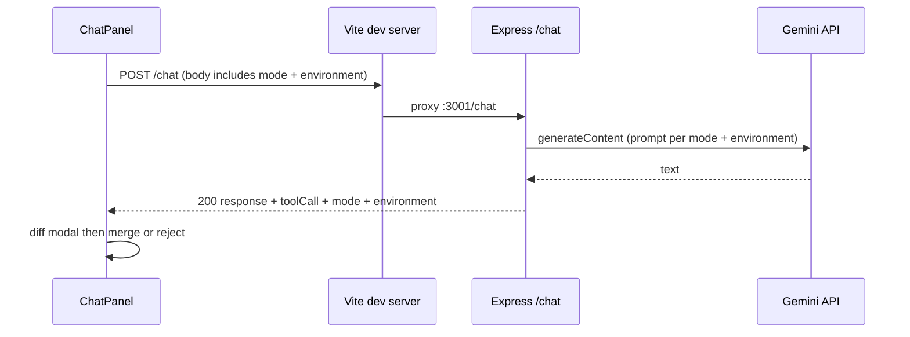

This is the system specification and intended behavior of the application.
It describes how the system should work.
For implementation history and changes, see: agent-memory.md

**How this repository was built:** The project was developed using **Cursor** for implementation and coding, and **ChatGPT** plus **Google Gemini** for planning, design discussions, and prompt engineering.

# Workspace documentation

Browser-based **multi-language workspace** (top bar **JavaScript** / **Python** / **C#**): each environment has its own in-memory files (**`*.js`**, **`*.py`**, or **`*.cs`**), Monaco editor, undo/redo, and AI chat context. **Run** uses **vm2** (JS), a Python subprocess, or **`dotnet run`** (C#). **Format** uses **Prettier**, **Black**, and **CSharpier**. **Google Gemini** chat supports **Chat**, **Agent**, and **Translate**. Stack: **Express** (`server/`) + **Vite + React 19** (`client/`).

**Implementation history (append-only, factual):** [`agent-memory.md`](./agent-memory.md) — update **this** file when **behavior or spec** changes; append **`agent-memory.md`** only for **code** changes; do not duplicate the same detail in both (prefer **`agent-memory.md`** for implementation detail when unsure).

---

## Table of contents

1. [Overview](#1-overview)  
2. [Quick start](#2-quick-start)  
3. [Configuration](#3-configuration)  
4. [Using the application](#4-using-the-application)  
5. [API reference](#5-api-reference)  
6. [Project layout](#6-project-layout)  
7. [Build and deployment notes](#7-build-and-deployment-notes)  
8. [Security and limitations](#8-security-and-limitations)  
9. [Troubleshooting](#9-troubleshooting)  
10. [For contributors and AI assistants](#10-for-contributors-and-ai-assistants)

---

## 1. Overview

| Part | Path | Stack | Default URL |
|------|------|-------|----------------|
| API | `server/` | Node.js, Express, ESM; **`vm2`** for JS **`POST /run`**; Python **`POST /run`** via subprocess | http://localhost:3001 |
| UI | `client/` | React 19, Vite 6, Monaco, lucide-react | http://localhost:5173 |

**High-level behavior**

- **Multi workspace:** The top bar language switch selects **`environment`**: isolated slices **`{ files, activePath }`** per language (JS, Python, C#), not shared. Defaults: **`main.js`**, **`main.py`**, **`main.cs`**. Explorer and chat see the active slice; **Run** / **Format** follow per-language flags in **`shared/workspaceEnvironments.js`**. **Undo/redo** is tracked **per environment** (in-memory only).
- **Persistence:** All slices plus **`environment`** are saved under **`localStorage`** key **`llm:dualWorkspace:v1`**. Missing slices (e.g. **C#** on older saves) are hydrated with defaults on load. Legacy **`llm:workspace:v1`** migrates into the JS slice. **Reset** restores all default workspaces and clears undo stacks.
- **Theme:** Top bar **Dark** / **Light** sets **`data-theme`** on **`<html>`** (CSS variables in **`index.css`**). Choice is persisted under **`localStorage`** key **`llm:theme:v1`**. Monaco uses **`vs-dark`** or **`light`** to match. Default is **dark** if storage is missing or invalid.
- **Export:** Top bar **Export ZIP** downloads **`javascript/`**, **`python/`**, and **`csharp/`** folders (all tabs in every workspace) plus **`README.txt`**, built in the browser via **`jszip`**.
- **Copy:** **Copy code** — raw file source (paste into an editor). **Copy snippet** — gist-style Markdown (`### filename` + fenced code block) for issues/chat. Per-file copy is via the explorer context menu (right-click) or the active tab’s editor header (**Copy code** / **Copy snippet**). Rename and delete stay as row icons in the explorer (and in the context menu).
- **AI chat:** Every **`POST /chat`** includes **`environment`** (must match the UI) and **`mode`** (**Chat**, **Agent**, or **Translate**). File keys must match the **source** workspace extension (e.g. **`*.cs`** for C#). **Agent** edits stay in that environment; **Translate** writes to another registered language (see §4.3).
- **Run:** **`POST /run`** with **`environment`** **`"js"`**, **`"python"`**, or **`"csharp"`**. JS uses **`vm2`**; Python uses **`runPython.js`**; C# uses **`runCsharp.js`** (temp console project + **`dotnet run`**). C# runs are slower (compile each time). See §5.4.
- **Format:** **Prettier** (browser) for **`.js`**; **Black** (server) for **`.py`**; **CSharpier** (server) for **`.cs`** (`dotnet tool install -g csharpier` on the host running Express). See §5.3.

**Gemini:** `@google/generative-ai`, API key: **`GEMINI_API_KEY`**. Chat calls **`generateContent`** with automatic model fallback in **`GEMINI_MODEL_FALLBACK_CHAIN`** (`server/services/geminiService.js`): **`gemini-2.5-flash`** → **`gemini-2.5-flash-lite`** → **`gemini-3-flash-preview`** → **`gemini-3.1-flash-lite`** → **`gemini-2.5-pro`**. On recoverable failures (e.g. model unavailable, 429, 5xx, empty reply), the server tries the next model; **401/403** and **400** do not advance the chain. Prompts use compact section tags; file bodies still respect **`MAX_CONTEXT_CHARS`** / **`MAX_FILE_CHARS`**.

---

## 2. Quick start

**Prerequisites:** Node.js **18+** recommended. **Optional:** Python **3** on **`PATH`** for Python Run/format; **[.NET SDK](https://dotnet.microsoft.com/download)** for C# Run/format (`dotnet` on PATH).

From the **repository root**:

```powershell
npm run install:all
```

Copy **`server/.env.example`** → **`server/.env`** and set **`GEMINI_API_KEY`**.

**Run both apps:**

```powershell
npm run dev
```

- UI: http://localhost:5173  
- API: http://localhost:3001  
- In dev, the UI calls **`/api/*`**, **`/chat`**, **`/run`** on the Vite origin; **`client/vite.config.js`** proxies those to Express.

**API only or UI only:**

```powershell
npm run dev:server
npm run dev:client
```

---

## 3. Configuration

Set variables in **`server/.env`** or the process environment. **`server/index.js`** imports **`./env.js`** first so `.env` is loaded before other server modules (including run timeout).

| Variable | Default | Purpose |
|----------|---------|---------|
| `PORT` | `3001` | API listen port |
| `CLIENT_ORIGIN` | `http://localhost:5173` | CORS allowed origin |
| `GEMINI_API_KEY` | _(required for chat)_ | Gemini API key |
| `RUN_VM_TIMEOUT_MS` | `1000` | **`environment: "js"`** on **`POST /run`** — wall-clock timeout (ms) for **`vm2`**, clamped **1–60000**; read when `runCode.js` loads (**restart** after change) |
| `RUN_PYTHON_TIMEOUT_MS` | _(falls back to `RUN_VM_TIMEOUT_MS`)_ | **`environment: "python"`** — subprocess wall-clock timeout (ms), clamped **1–60000** |
| `PYTHON_BIN` | `python` on Windows, `python3` elsewhere | **`environment: "python"`** — executable passed to **`spawnSync`** |

**Tracked template:** `server/.env.example` (never commit real secrets).

---

## 4. Using the application

### 4.1 Workspace environments (JavaScript, Python, C#)

Each language is configured in **`shared/workspaceEnvironments.js`** (extension, Monaco id, export folder, **Run** / **Format** flags).

- **JavaScript (`*.js`):** e.g. `main.js`, `untitled-1.js`. New files start empty. Rename uses a fixed **`.js`** suffix in the UI.
- **Python (`*.py`):** e.g. `main.py`, `untitled-1.py`. Same rules with **`.py`**.
- **C# (`*.cs`):** e.g. `main.cs`, `untitled-1.cs`. Monaco **csharp** highlighting; **Format** (CSharpier) and **Run** (`dotnet run` on a temp project). Source must be a **compilable program** (e.g. `class Program` with `Main`). Same explorer, AI, copy, export, and translate rules as other languages.
- Workspaces **do not share** `files` or `activePath`. Switching the top bar swaps editor + explorer context. **Chat** threads reset when you switch (in-memory per visit).
- **Delete:** You cannot delete the **last** file in an environment.
- **Adding a language:** Add an entry to **`WORKSPACE_ENVIRONMENTS`** and default files in **`workspaceStorage.js`**; most UI and translate wiring follows the registry.

### 4.2 Editor, export, and Run

- Monaco language follows the **active environment** (JavaScript, Python, or C#). The editor header shows the active filename, language badge, **Copy code**, **Copy snippet**, **Format**, and **Run** (disabled when not supported for that language).
- **Format document:** **`.js`** — **Prettier** in the browser (`client/src/formatJavaScript.js`). **`.py`** and **`.cs`** — **`POST /format`** with matching **`environment`**; the server runs **Black** or **CSharpier** on stdin. Formatted text replaces the active tab and is undoable.
- **Export ZIP:** **Export ZIP** in the top bar saves both workspace slices (not only the active environment). Filenames are timestamped (`llm-workspace-YYYYMMDD-HHMM.zip`).
- **Run** sends the active tab with matching **`environment`**. The Output header shows **Completed in … ms** or **Timed out at … ms**; errors get short labels (**Syntax error**, **Timeout**, etc.). JS: **`console.*`**; Python: **stdout** / **stderr**; C#: **stdout** plus build errors in **error**. ANSI stripped from **`output`** / **`error`** (see §4.5). C# is slower (compile per run).

### 4.3 AI chat and file proposals

- The chat panel has **Chat**, **Agent**, and **Translate** modes (toggle in the header). Every request includes **`mode`** and **`environment`** (source workspace: **`"js"`**, **`"python"`**, or **`"csharp"`**; must match the UI).
- **Chat mode:** The server never parses or applies tool JSON; replies are natural language (Markdown allowed). The client ignores any **`toolCall`** unless **`mode`** and **`environment`** from the server match the request.
- **Agent mode:** The model returns **`edit_file`** or **`create_file`** JSON with a filename valid for the **current** environment (e.g. **`.cs`** on C#). Valid payloads open **`AiEditPreviewModal`**. **Accept** updates only that environment’s `files` / `activePath`.
- **Translate mode:** Ports the **active file** to another registered language. The **To** switch lists only **other** languages (e.g. JS → Python or C#). Output names use a **`_converted`** suffix (e.g. `main.js` → `main_converted.cs`). **Accept** writes to the target workspace and switches the top bar there.
- **Adding languages later:** Register entries in **`shared/workspaceEnvironments.js`**; translation targets, filename rules, and chat Agent/Translate prompts follow via **`normalizeWorkspaceEnvironment`** (server + client).
- Composer sends **`message`**, **`files`**, **`currentFile`**, **`mode`**, and **`environment`** to **`POST /chat`** (plus translate fields when applicable). A small footer above the composer shows **which model answered** the last reply, highlights it in the fallback chain, and marks **fallback** when a later model was used after an earlier failure.

### 4.5 Testing Run output (ANSI cleanup)

**Automated (server):**

```powershell
cd server
npm run test:strip-ansi
npm run test:run-error-kind
npm run test:run-csharp
```

**Manual in the UI (Python — typical colored tracebacks):**

1. Switch to **Python**, open `main.py`, paste and **Run**:

```python
def dangerous_recursion(n=0):
    return dangerous_recursion(n + 1)

dangerous_recursion()
```

2. **Expect:** Output **error** shows a normal traceback (`File "<stdin>"`, `RecursionError`, …) with **no** `[35m`, `[0m`, or other escape junk.

**Manual (Python — explicit ANSI in print):**

```python
print("\033[31mred\033[0m plain")
raise RuntimeError("after color")
```

3. **Expect:** `red plain` in **output** (or error text without raw `\033` sequences).

**Manual (API with curl / Invoke-RestMethod):**

```powershell
$body = @{ code = "print(chr(27)+'[31mhi'+chr(27)+'[0m')"; environment = "python" } | ConvertTo-Json
Invoke-RestMethod -Uri http://localhost:3001/run -Method POST -ContentType "application/json" -Body $body
```

4. **Expect:** JSON **`output`** is `hi` (or `hi` plus newline), not containing `[31m`.

**JavaScript:** vm2 errors rarely include ANSI; run `throw new Error("fail")` and confirm the message displays normally.

### 4.4 Workspace state (reference)

| Topic | Behavior |
|-------|----------|
| Storage | `App.jsx` holds **`dualWorkspace`** `{ environment, js, python, csharp, … }` slices; persisted via **`workspaceStorage.js`** key **`llm:dualWorkspace:v1`**. |
| Migrate | Legacy **`llm:workspace:v1`** hydrates **JS**; missing slices (e.g. **csharp**) get defaults on load. |
| Create | Next free `untitled-N` + extension per **`environment`**. |
| Select | Sets **`activePath`** inside the active slice only. |
| Delete | Confirm → remove key (not the last file); pick next active; bump `editorNonce` if needed. |
| Rename | **`workspaceFileValidation.js`** + **`shared/workspaceFilename.js`** enforce the correct extension per environment. |
| Editor | `CodeEditor` **`key`** includes **`environment`** so Monaco remounts on environment switch. |
| Undo / redo | Max **40** snapshots **per environment**; each snapshot is `{ files, activePath }` for that slice only. |

Chat request flow:



---

## 5. API reference

### 5.1 Route index

| Method | Path | Success body (shape) |
|--------|------|----------------------|
| GET | `/api/health` | `{ ok, service, timestamp }` |
| GET | `/api/hello` | `{ message }` |
| POST | `/chat` | `{ response, toolCall, mode, environment, model, modelFallback, modelChain }` — see §5.2 |
| POST | `/run` | `{ output, error, durationMs, timeoutMs, runStatus, errorKind, errorLabel }` — see §5.4 |
| POST | `/format` | `{ code, error }` — **Black** (python) or **CSharpier** (csharp); JS is formatted in the browser |

### 5.2 `POST /chat`

- **URLs:** `http://localhost:5173/chat` (proxied) or `http://localhost:3001/chat`
- **Headers:** `Content-Type: application/json` (body limit **4 MB**)
- **Body:** `message` (string, required for **chat** / **agent**; optional for **translate** — default prompt used if empty). Optional **`files`** (≤200 keys), **`currentFile`** (string \| null), **`mode`** (`"chat"` \| `"agent"` \| `"translate"`, default **`"chat"`**), **`environment`** (`"js"` \| `"python"`, default **`"js"`** — **source** workspace). **Translate only:** **`targetEnvironment`** (must differ from **`environment`**), **`targetFiles`** (object of existing target paths), **`expectedFilename`** (optional; default `basename_converted` + target ext, with numeric suffix on collision). Keys in **`files`** / **`currentFile`** use the **source** extension; **`targetFiles`** keys use the **target** extension.
- **200:** `response`, `toolCall`, **`mode`**, **`environment`**, and for **translate** also **`targetEnvironment`**, **`expectedFilename`**. Also **`model`**, **`modelFallback`**, **`modelChain`**.
- **Chat mode:** The server does not run structured-output parsing for tools; the model is instructed not to emit **`edit_file`** / **`create_file`** JSON.
- **Agent mode:** The server parses model text with `assistantOutput.js` against **`environment`**; a reply without a valid tool payload is an error (**502**).
- **Translate mode:** Parses tool JSON against **`targetEnvironment`**; **`filename`** must match **`expectedFilename`**. Requires **`currentFile`** in the source workspace.
- **Errors:** JSON with `error` and usually `detail`; typical statuses **400**, **401/403**, **429**, **500**, **502** (see prior README behavior — missing key, rate limits, upstream failures).

### 5.3 `POST /format`

- **URLs:** `http://localhost:5173/format` (proxied) or `http://localhost:3001/format`
- **Body:** **`code`** (string, required). **`environment`**: **`"python"`** (Black) or **`"csharp"`** (CSharpier). **`"js"`** returns **400** (Prettier in the browser). Legacy **`runtime`** is accepted like **`POST /run`**. Same max length as Run (**`MAX_RUN_CODE_CHARS`**).
- **200:** **`{ code, error }`**. On success **`error`** is empty and **`code`** is the formatted source. On formatter failure **`code`** may be empty and **`error`** explains (e.g. tool not installed, syntax error).
- **Python — Black:** [Black](https://black.readthedocs.io/) on the server host — e.g. **`py -m pip install black`**. Fallback chain: **`black`**, **`PYTHON_BIN -m black`**, **`py -m black`**. **`BLACK_BIN`**, **`FORMAT_PYTHON_TIMEOUT_MS`** (default **15000**, max **60000**).
- **C# — CSharpier:** [.NET SDK](https://dotnet.microsoft.com/download) + **`dotnet tool install -g csharpier`**. Server writes a temp **`.cs`** file and runs **`csharpier format <path>`** (in-place). Tries **`csharpier`**, then **`dotnet csharpier`**, then **`dotnet tool run csharpier`** (Windows). **`CSHARPIER_BIN`**, **`FORMAT_CSHARP_TIMEOUT_MS`** (falls back to **`FORMAT_PYTHON_TIMEOUT_MS`**).

### 5.4 `POST /run`

- **URLs:** `http://localhost:5173/run` (proxied) or `http://localhost:3001/run`
- **Body:** **`code`** (string, required). Optional **`environment`**: **`"js"`** \| **`"python"`** \| **`"csharp"`** (default **`"js"`**). Legacy **`runtime`** is accepted. Max **`MAX_RUN_CODE_CHARS`** applies to **`code`**.
- **200:** **`{ output, error, durationMs, timeoutMs, runStatus, errorKind, errorLabel }`**. **`output`** and **`error`** are passed through **`stripAnsi`**. **`timeoutMs`**: **`RUN_VM_TIMEOUT_MS`** (JS), **`RUN_PYTHON_TIMEOUT_MS`** (Python), **`RUN_CSHARP_TIMEOUT_MS`** (C#, default **30000**). **`errorLabel`** buckets include **Syntax error** (e.g. C# **CS####** build errors).
- **`environment: "js"`** (default): **`executeJavaScript`** — **`vm2`** sandbox.
- **`environment: "python"`**: **`executePython`** — Python subprocess on stdin.
- **`environment: "csharp"`**: **`executeCsharp`** — temp **`RunSnippet.csproj`** + **`Program.cs`**, then **`dotnet run`**. Requires a compilable console program. **`DOTNET_TFM`** (default **`net8.0`**), **`DOTNET_BIN`**, **`RUN_CSHARP_TIMEOUT_MS`**.
- **400 / 500:** Same JSON shapes; **400** if **`runSupported`** is false for that language.

---

## 6. Project layout

```
.
├── agent-memory.md       # Append-only implementation changelog (see top of README)
├── package.json
├── README.md
├── shared/
│   ├── workspaceEnvironments.js   # Language registry (js, python, csharp, …)
│   └── workspaceFilename.js         # Generic *.ext validation
├── server/
│   ├── index.js
│   ├── env.js
│   ├── chatBody.js
│   ├── assistantOutput.js
│   ├── workspaceFilename.js
│   ├── workspaceFileValidation.js
│   ├── runCode.js
│   ├── runPython.js
│   ├── runCsharp.js
│   ├── formatPython.js
│   ├── formatCsharp.js
│   ├── runMeta.js
│   ├── stripAnsi.js
│   ├── scripts/
│   │   └── test-strip-ansi.mjs
│   ├── .env.example
│   └── services/
│       └── geminiService.js
└── client/
    ├── vite.config.js
    ├── index.html
    ├── public/favicon.svg
    └── src/
        ├── main.jsx
        ├── App.jsx
        ├── App.css
        ├── index.css
        ├── workspaceFilename.js
        ├── workspaceFileValidation.js
        ├── workspaceStorage.js
        ├── formatJavaScript.js
        └── components/
            ├── FileExplorer.jsx
            ├── CodeEditor.jsx
            ├── ChatPanel.jsx
            └── AiEditPreviewModal.jsx
```

**Key client files**

| File | Role |
|------|------|
| `App.jsx` | Multi **`environment`**, workspace slices, per-env undo/redo, Run/Format/output, AI diff + toast, theme toggle |
| `formatJavaScript.js` | Prettier format for **`.js`** in the browser |
| `theme.js` | **`loadTheme`** / **`persistTheme`** / **`applyTheme`**; key **`llm:theme:v1`** |
| `workspaceSnippet.js` | **`formatGistSnippet`** — Markdown gist blocks for clipboard |
| `exportWorkspaceZip.js` | **`downloadDualWorkspaceZip`** — browser ZIP via **`jszip`** |
| `copyToClipboard.js` | **`copyTextToClipboard`** |
| `workspaceFilename.js` / `workspaceFileValidation.js` | Path policy and validators |
| `workspaceStorage.js` | Dual-workspace **`localStorage`** (`llm:dualWorkspace:v1`), legacy **`llm:workspace:v1`** migration |
| `FileExplorer.jsx` | List, new file, rename (**.js** / **.py** suffix UI per environment), delete |
| `CodeEditor.jsx` | Monaco; **`key`** includes **`environment`** |
| `ChatPanel.jsx` | Thread + `POST /chat` (Chat / Agent / Translate); **To** language switch in Translate; footer shows **`model`** / **`modelChain`** |
| `shared/workspaceEnvironments.js` | Language registry, translation targets, **`buildConvertedFilename`** |
| `AiEditPreviewModal.jsx` | Diff editor + accept/reject |

**Notable client deps:** `lucide-react`, `@monaco-editor/react`, `monaco-editor`, `vite-plugin-monaco-editor` (Monaco workers; use `default` export interop in `vite.config.js`).

---

## 7. Build and deployment notes

**Client build (from `client/` or root per your scripts):**

```powershell
npm run build
```

Output: **`client/dist/`**, including **`monacoeditorwork/`** for workers — deploy with same relative URL layout as `index.html`.

**API production:** `npm start` in `server/` runs `index.js` (no watch). Serving **`client/dist`** from Express is **not** wired in this repo yet.

**Vite preview / static hosting:** Proxy **`/chat`** and **`/run`** to the API, or use absolute API URLs — the client uses relative **`/chat`** and **`/run`**.

**Layout tokens:** Explorer width `--width-explorer` (244px), chat `--width-chat` (384px). **Accessibility:** chat log `role="log"`, `aria-live="polite"`; hidden label on chat input.

---

## 8. Security and limitations

- **`vm2` is unmaintained**; sandbox settings reduce accidental Node access and dynamic code paths but are **not** a guarantee against determined attackers. Use separate processes/containers for hostile or production execution.
- **Python `POST /run`** uses a normal OS subprocess with **`-I`** (no user **`site-packages`**) but **full CPython** still has **`import os`**, sockets, and file access unless you add OS-level containment. **Do not** expose this endpoint to untrusted networks without additional hardening.
- **Workspace data** in the browser is stored in **`localStorage`** (same-origin); treat tab contents as sensitive if you paste secrets. **Reset** or private browsing limits retention; there is no server-side file store unless you add one.
- **Gemini** key must stay out of git; use **`server/.env`**.

---

## 9. Troubleshooting

| Symptom | Likely cause |
|---------|----------------|
| “Could not reach API” / fetch errors | API down or wrong port / proxy |
| CORS errors | `CLIENT_ORIGIN` mismatch with actual UI origin |
| `npm run dev` fails | Run `npm run install:all` from root |
| `POST /chat` 500 “Server configuration” | Missing `GEMINI_API_KEY` |
| `POST /chat` 401/403 | Bad or disabled API key |
| `POST /chat` 400 “files” | Invalid `files` / `currentFile` or non-`*.js` keys |
| `POST /chat` 502 / “Agent mode: expected…” | **Agent** mode: model output was not exactly one valid **`edit_file`** / **`create_file`** JSON object |
| `POST /run` 400 | Bad **`code`** type, over max length, or malformed JSON |
| `POST /run` timeout / killed | Output shows **Timed out at N ms** and **Timeout** label. **JS:** raise **`RUN_VM_TIMEOUT_MS`** and restart server. **Python:** **`RUN_PYTHON_TIMEOUT_MS`**. |
| `POST /run` async / eval issues (**JS** only) | **`allowAsync: false`**, **`eval: false`** — use simple synchronous scripts |
| `POST /run` “Python not found” | **Python** runtime: interpreter missing or wrong **`PYTHON_BIN`** |
| Format toast “Black not found” | On the server host: `py -m pip install black` (or `pip install black`). Restart **`npm run dev`**. Optional **`BLACK_BIN=py -m black`** in **`server/.env`** |
| Format toast “CSharpier is not available” | Install [.NET SDK](https://dotnet.microsoft.com/download), then `dotnet tool install -g csharpier`. Restart **`npm run dev`**. Optional **`CSHARPIER_BIN`** in **`server/.env`** |
| C# Run slow or times out | Normal (compile each run). Raise **`RUN_CSHARP_TIMEOUT_MS`** (e.g. **60000**) in **`server/.env`**. Ensure **`Program.cs`** is a valid console app with **`Main`**. |
| C# Run “dotnet not found” | Install [.NET SDK](https://dotnet.microsoft.com/download). Restart **`npm run dev`**. Optional **`DOTNET_BIN`** |
| Run disabled | No active `.js` tab |
| Rename blocked | Invalid base name, separators, or duplicate after normalization |
| Output “gone” | Output panel minimized — expand via chevron or Run |
| Monaco workers 404 in prod | Ship `monacoeditorwork` with `dist` |
| Workspace not restored after refresh | Corrupt or cleared `localStorage`, private mode, or quota — falls back to defaults; use **Reset** to force defaults |
| Files “missing” after refresh | Rare parse/validation failure on stored JSON — defaults apply; check browser storage for key `llm:workspace:v1` |

---

## 10. For contributors and AI assistants

When requesting changes, specify: **which side** (`server` / `client` / both), **goal**, **API contract** (method, path, body, responses), **env** and secrets handling, **ports** (align CORS + Vite proxy), and any **Gemini** / **Monaco** constraints.

**Touch points by feature**

| Area | Typical files |
|------|----------------|
| Chat / Gemini | `server/services/geminiService.js`, `assistantOutput.js`, `chatBody.js`, `ChatPanel.jsx`, `App.jsx` |
| Workspace paths / validation | `workspaceFilename.js`, `workspaceFileValidation.js` (client + server), `FileExplorer.jsx`, `App.jsx` |
| Browser workspace persistence | `workspaceStorage.js`, `App.jsx` (persist effect, **Reset**), `App.css` (reset button) |
| Run (JS + Python) | `server/runCode.js`, `server/runPython.js`, `server/runMeta.js`, `server/stripAnsi.js`, `server/index.js`, `client/vite.config.js`, `App.jsx`, `App.css` |
| Format (Prettier + Black + CSharpier) | `client/src/formatJavaScript.js`, `server/formatPython.js`, `server/formatCsharp.js`, `server/index.js` (`POST /format`), `App.jsx`, `vite.config.js` |
| UI / Monaco | `App.css`, `index.css`, `CodeEditor.jsx`, `vite.config.js`, `index.html`, `public/favicon.svg` |

Record **factual implementation changes** in [`agent-memory.md`](./agent-memory.md) (append-only).
