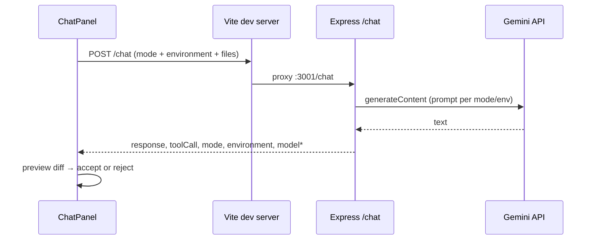

This document is the **system specification** for the application: intended behavior, setup, API contracts, and operational notes.

**Implementation history** (append-only, factual changelog): [`agent-memory.md`](./agent-memory.md)

| Document | Update when… |
|----------|----------------|
| **README.md** | Behavior, user-facing features, API contracts, or setup change |
| **agent-memory.md** | Code lands; append entries—do not duplicate long implementation detail in both |

**How this repository was built:** **Cursor** for implementation; **ChatGPT** and **Google Gemini** for planning, design, and prompt engineering.

---

# Multi-language workspace

Browser-based editor for **JavaScript**, **Python**, and **C#**. Each language has its own file list, Monaco buffer, undo/redo stack, and AI context. **Run** and **Format** are per-language. **Google Gemini** powers **Chat**, **Agent**, and **Translate** modes.

**Stack:** Express API (`server/`) + Vite + React 19 UI (`client/`) + shared registry (`shared/`).

---

## Table of contents

1. [Overview](#1-overview)
2. [Quick start](#2-quick-start)
3. [Configuration](#3-configuration)
4. [Using the application](#4-using-the-application)
5. [API reference](#5-api-reference)
6. [Project layout](#6-project-layout)
7. [Build and deployment](#7-build-and-deployment)
8. [Security and limitations](#8-security-and-limitations)
9. [Troubleshooting](#9-troubleshooting)
10. [Contributors and AI assistants](#10-contributors-and-ai-assistants)

---

## 1. Overview

| Part | Path | Stack | Default URL |
|------|------|-------|----------------|
| API | `server/` | Node.js, Express (ESM), `vm2`, subprocess runners | http://localhost:3001 |
| UI | `client/` | React 19, Vite 6, Monaco, lucide-react | http://localhost:5173 |

### Core behavior

| Area | Behavior |
|------|----------|
| **Workspaces** | Top bar switches **`environment`**: isolated `{ files, activePath }` per language. Defaults: `main.js`, `main.py`, `main.cs`. Registry: `shared/workspaceEnvironments.js`. |
| **Persistence** | `localStorage` key **`llm:dualWorkspace:v1`**. Legacy **`llm:workspace:v1`** migrates into the JS slice. Missing slices (e.g. C# on old saves) hydrate with defaults. **Reset** restores all languages and clears undo. |
| **Undo / redo** | Up to **40** snapshots **per environment** (in-memory only). |
| **Theme** | **Dark** / **Light** on `<html>` (`data-theme`); persisted as **`llm:theme:v1`**. Monaco follows (`vs-dark` / `light`). |
| **Export** | **Export ZIP** — all files in **every** environment under `javascript/`, `python/`, `csharp/` plus `README.txt` (browser, `jszip`). |
| **Copy** | **Copy code** (raw source) and **Copy snippet** (gist-style Markdown). Explorer: right-click or row actions; editor header buttons for the active tab. |
| **Run** | `POST /run` — JS (**vm2**), Python (subprocess, stdin), C# (temp project + **`dotnet run`**). Default wall-clock limit **5 s** per language (configurable). |
| **Format** | JS: **Prettier** in the browser. Python: **Black** on server. C#: **CSharpier** on server (temp file, deleted after format). |
| **AI** | `POST /chat` with **`mode`** and **`environment`**. **Agent** edits the current language; **Translate** ports the active file to another registered language (`_converted` naming). |

### Gemini

- Package: `@google/generative-ai`; key: **`GEMINI_API_KEY`** in `server/.env`.
- Model fallback chain (`server/services/geminiService.js`): **`gemini-2.5-flash`** → **`gemini-2.5-flash-lite`** → **`gemini-3-flash-preview`** → **`gemini-3.1-flash-lite`** → **`gemini-2.5-pro`**.
- Retries on recoverable failures (unavailable model, 429, 5xx, empty reply). **401**, **403**, and **400** do not advance the chain.
- Prompts use section tags (`[paths]`, `[active]`, `[file …]`, rules block). Context caps: **`MAX_CONTEXT_CHARS`** 200 000 total, **`MAX_FILE_CHARS`** 120 000 per file (truncation noted in prompt when applied).

---

## 2. Quick start

**Prerequisites**

| Requirement | Used for |
|-------------|----------|
| **Node.js 18+** | API and UI |
| **Python 3** on `PATH` (optional) | Python Run / Black format |
| **[.NET SDK](https://dotnet.microsoft.com/download)** (optional) | C# Run / CSharpier format |

From the **repository root**:

```powershell
npm run install:all
```

Copy **`server/.env.example`** → **`server/.env`** and set **`GEMINI_API_KEY`**.

**Run API + UI:**

```powershell
npm run dev
```

| Service | URL |
|---------|-----|
| UI | http://localhost:5173 |
| API | http://localhost:3001 |

In development, the UI uses relative **`/api/*`**, **`/chat`**, **`/run`**, **`/format`**; Vite proxies them to Express (`client/vite.config.js`).

**Run one side only:**

```powershell
npm run dev:server
npm run dev:client
```

**Optional — install format/run tools on the machine that runs Express:**

```powershell
py -m pip install black
dotnet tool install -g csharpier
```

Restart `npm run dev` after changing `server/.env`.

---

## 3. Configuration

Variables live in **`server/.env`** or the process environment. **`server/env.js`** loads `.env` before other server modules (including timeout resolution).

**Template (committed):** `server/.env.example` — never commit real secrets.

### Server and chat

| Variable | Default | Purpose |
|----------|---------|---------|
| `PORT` | `3001` | API listen port |
| `CLIENT_ORIGIN` | `http://localhost:5173` | CORS allowed origin |
| `GEMINI_API_KEY` | — | **Required** for `POST /chat` |

### Run timeouts (`POST /run`)

| Variable | Default | Purpose |
|----------|---------|---------|
| `RUN_VM_TIMEOUT_MS` | `5000` | JavaScript (**vm2**), clamped **1–60000** |
| `RUN_PYTHON_TIMEOUT_MS` | falls back to `RUN_VM_TIMEOUT_MS` | Python subprocess, clamped **1–60000** |
| `RUN_CSHARP_TIMEOUT_MS` | falls back to `RUN_PYTHON_TIMEOUT_MS`, then **5000** | C# **`dotnet run`**, clamped **1–120000** |

Restart the server after changing run timeouts (`runCode.js` reads `RUN_VM_TIMEOUT_MS` at module load; Python/C# read env per request).

### Run executables

| Variable | Default | Purpose |
|----------|---------|---------|
| `PYTHON_BIN` | `python` (Windows) / `python3` (elsewhere) | Python interpreter for Run |
| `DOTNET_BIN` | `dotnet` | .NET SDK CLI for C# Run |
| `DOTNET_TFM` | `net8.0` | Target framework in temp `RunSnippet.csproj` |

### Format (`POST /format` and browser Prettier)

| Variable | Default | Purpose |
|----------|---------|---------|
| `FORMAT_PYTHON_TIMEOUT_MS` | `15000` | Black subprocess, max **60000** |
| `BLACK_BIN` | _(auto chain)_ | Override Black invocation (e.g. `py -m black`) |
| `FORMAT_CSHARP_TIMEOUT_MS` | falls back to `FORMAT_PYTHON_TIMEOUT_MS` | CSharpier, max **60000** |
| `CSHARPIER_BIN` | _(auto chain)_ | Override CSharpier (e.g. `dotnet csharpier format`) |

---

## 4. Using the application

### 4.1 Workspace environments

Languages are defined in **`shared/workspaceEnvironments.js`** (`WORKSPACE_ENVIRONMENTS`): extension, Monaco language id, export folder, **runSupported**, **formatSupported**, UI hints.

| Environment | Extension | Run | Format |
|-------------|-----------|-----|--------|
| JavaScript (`js`) | `.js` | Server (**vm2**) | Browser (**Prettier**) |
| Python (`python`) | `.py` | Server (subprocess) | Server (**Black**) |
| C# (`csharp`) | `.cs` | Server (**`dotnet run`**) | Server (**CSharpier**) |

**Rules (all languages)**

- Filenames are a **single basename** with the correct extension (no `/` or `\`).
- **New files** start **empty** (no boilerplate comment injected).
- **Rename** in the explorer keeps the environment’s extension suffix in the UI.
- **Delete** is blocked for the **last** file in an environment.
- Switching the top bar swaps editor + explorer; **chat threads reset** (in-memory per page visit).
- **Adding a language:** register in `WORKSPACE_ENVIRONMENTS`, add defaults in `workspaceStorage.js`; translation targets and chat normalization follow the registry.

**C# Run note:** Source must be a **compilable console program** (e.g. `class Program` with `Main`). Each run creates a temp project, compiles, and runs—slower than JS/Python.

### 4.2 Editor, Run, Format, export

- **Monaco** language follows the active environment.
- **Format** — enabled only on a valid active file for that environment. JS formats in-browser; `.py` / `.cs` call `POST /format`. Result replaces the tab and is undoable.
- **Run** — same file gating. Output panel shows duration, **Timeout** / error labels, stdout vs stderr-style **error** text. ANSI escape sequences are stripped server-side.
- **Export ZIP** — timestamped archive (`llm-workspace-YYYYMMDD-HHMM.zip`) with **all** environments, not only the active one.

### 4.3 AI chat (Chat, Agent, Translate)

**Modes**

| Mode | Server behavior | Client behavior |
|------|-----------------|-----------------|
| **Chat** | Natural language only; no tool JSON parsing | Ignores `toolCall` unless mode/env mismatch |
| **Agent** | Expects one `edit_file` or `create_file` JSON for **current** `environment` | Opens **AiEditPreviewModal** on valid tool + matching `environment` |
| **Translate** | Ports active file to **`targetEnvironment`**; tool JSON validated against **target** ext | **To** switch lists other registry languages; **Accept** writes target slice and can switch workspace |

**Request fields (typical):** `message`, `files`, `currentFile`, `mode`, `environment`. Translate adds `targetEnvironment`, `targetFiles`, `expectedFilename` (optional; default `*_converted` + target ext with numeric suffix on collision).

**Response metadata:** `model`, `modelFallback`, `modelChain` — shown in the chat footer (highlights which model answered and whether fallback was used).

**Environment IDs** in API bodies: `js`, `python`, `csharp` (aliases like `javascript` or `c#` normalize on the server). **`environment` must match the UI** for Agent tools to apply.



### 4.4 Workspace state (reference)

| Topic | Detail |
|-------|--------|
| In-memory shape | `dualWorkspace`: `{ environment, js, python, csharp, … }` |
| Storage key | `llm:dualWorkspace:v1` via `workspaceStorage.js` |
| Migration | `llm:workspace:v1` → JS slice; missing env slices get defaults |
| Create file | Next free `untitled-N` + extension |
| Editor remount | `CodeEditor` `key` includes `environment` |
| Validation | `shared/workspaceFilename.js` + per-app wrappers |

### 4.5 Testing Run output (ANSI cleanup)

**Automated (from `server/`):**

```powershell
npm run test:strip-ansi
npm run test:run-error-kind
npm run test:run-csharp
npm run test:workspace-env
```

**Manual — Python colored traceback**

1. Python workspace, `main.py`, **Run**:

```python
def dangerous_recursion(n=0):
    return dangerous_recursion(n + 1)

dangerous_recursion()
```

2. Expect a readable traceback **without** `[35m` / `[0m` junk in the UI.

**Manual — API**

```powershell
$body = @{ code = "print(chr(27)+'[31mhi'+chr(27)+'[0m')"; environment = "python" } | ConvertTo-Json
Invoke-RestMethod -Uri http://localhost:3001/run -Method POST -ContentType "application/json" -Body $body
```

Expect `"output"` containing `hi`, not raw escape sequences.

---

## 5. API reference

Base URL in dev (proxied): `http://localhost:5173` — same paths on `http://localhost:3001` when calling Express directly.

### 5.1 Route index

| Method | Path | Success body (summary) |
|--------|------|-------------------------|
| GET | `/api/health` | `{ ok, service, timestamp }` |
| GET | `/api/hello` | `{ message }` |
| POST | `/chat` | `{ response, toolCall, mode, environment, model, modelFallback, modelChain, … }` |
| POST | `/run` | `{ output, error, durationMs, timeoutMs, runStatus, errorKind, errorLabel }` |
| POST | `/format` | `{ code, error }` — Python / C# only (JS → 400) |

Unknown routes: **404** `{ error: "Not found" }`.

### 5.2 `POST /chat`

- **Headers:** `Content-Type: application/json` (body limit **4 MB**)
- **Body**
  - **`message`** — required for **chat** / **agent**; optional for **translate** (default prompt if empty)
  - **`files`** — optional object, ≤ **200** keys, values strings (empty allowed)
  - **`currentFile`** — optional string or null (active editor path)
  - **`mode`** — `"chat"` \| `"agent"` \| `"translate"` (default `"chat"`)
  - **`environment`** — `"js"` \| `"python"` \| `"csharp"` (default `"js"`); **source** workspace for translate
  - **Translate only:** `targetEnvironment`, `targetFiles`, `expectedFilename`
- **Paths:** keys must match the workspace extension for that environment (e.g. `*.cs` when `environment` is `csharp`).
- **200:** `response`, `toolCall` (null in chat), `mode`, `environment`; translate also returns `targetEnvironment`, `expectedFilename`; plus `model`, `modelFallback`, `modelChain`.
- **Errors:** JSON `{ error, detail? }` — **400** validation, **500** config, **502** Gemini / agent parse failures, etc.

### 5.3 `POST /format`

- **Body:** **`code`** (string, required, max **`MAX_RUN_CODE_CHARS`** = **500 000**)
- **`environment`:** `"python"` (Black) or `"csharp"` (CSharpier). **`"js"`** → **400** (use Prettier in the UI). Legacy **`runtime`** accepted (same as `/run`).
- **200:** `{ code, error }` — on success `error` is empty.
- **Python:** [Black](https://black.readthedocs.io/) via stdin; install e.g. `py -m pip install black`. Fallback: `black`, `PYTHON_BIN -m black`, `py -m black`.
- **C#:** temp dir `llm-csharpier-*`, format in place, **removed in `finally`**. Fallback: `csharpier`, `dotnet csharpier`, `dotnet tool run csharpier`.

### 5.4 `POST /run`

- **Body:** **`code`** (string, required, max **500 000** chars). **`environment`:** `js` \| `python` \| `csharp` (default `js`). Legacy **`runtime`** accepted.
- **200:** `output`, `error`, `durationMs`, `timeoutMs`, `runStatus` (`ok` \| `error` \| `timeout`), `errorKind`, `errorLabel`.
- **Executors**
  - **`js`:** `vm2` — stub `console` only; `eval` / `wasm` / async disabled.
  - **`python`:** `python -I -u -` (stdin script).
  - **`csharp`:** temp dir `llm-csharp-run-*` with `Program.cs` + `RunSnippet.csproj`, then `dotnet run`; temp dir **deleted in `finally`**.
- **400** if `runSupported` is false for that registry entry.

---

## 6. Project layout

```
.
├── agent-memory.md              # Implementation changelog (append-only)
├── package.json                 # Root scripts: dev, build, install:all
├── README.md
├── shared/
│   ├── workspaceEnvironments.js # Language registry + translate helpers
│   ├── workspaceEnvironments.types.js
│   └── workspaceFilename.js     # Extension-aware filename rules
├── server/
│   ├── index.js                 # Express routes
│   ├── env.js                   # dotenv load
│   ├── chatBody.js              # mode/env normalization, files parsing
│   ├── assistantOutput.js       # Agent/translate tool JSON parse
│   ├── workspaceFileValidation.js
│   ├── runCode.js               # JS vm2 + DEFAULT_RUN_TIMEOUT_MS
│   ├── runPython.js
│   ├── runCsharp.js
│   ├── runMeta.js               # errorKind / runStatus / timeoutMs in response
│   ├── formatPython.js
│   ├── formatCsharp.js
│   ├── stripAnsi.js
│   ├── scripts/
│   │   ├── test-strip-ansi.mjs
│   │   ├── test-run-error-kind.mjs
│   │   ├── test-run-csharp.mjs
│   │   └── test-workspace-env.mjs
│   ├── .env.example
│   └── services/
│       └── geminiService.js
└── client/
    ├── vite.config.js           # @shared alias, Monaco plugin, API proxy
    └── src/
        ├── App.jsx              # Workspaces, Run/Format, AI merge, theme
        ├── workspaceStorage.js
        ├── formatJavaScript.js
        ├── exportWorkspaceZip.js
        ├── theme.js
        ├── workspaceSnippet.js
        ├── copyToClipboard.js
        └── components/
            ├── FileExplorer.jsx
            ├── CodeEditor.jsx
            ├── ChatPanel.jsx
            └── AiEditPreviewModal.jsx
```

**Client ↔ server shared code:** `shared/` is imported as `@shared` in the client (Vite alias) and via relative paths in the server.

---

## 7. Build and deployment

```powershell
npm run build          # client → client/dist/
npm start              # server only (root script → server/index.js)
```

- **Monaco workers:** production build includes `monacoeditorwork/` under `dist/` — deploy with the same relative paths as `index.html`.
- **Static UI:** Express does **not** serve `client/dist` in this repo; use Vite preview, a static host, or add static middleware yourself.
- **Proxies:** Any static host must forward **`/chat`**, **`/run`**, **`/format`**, **`/api`** to the API (or change the client to absolute API URLs).

**UI tokens:** Explorer `--width-explorer` (244px), chat `--width-chat` (384px). Chat log: `role="log"`, `aria-live="polite"`.

---

## 8. Security and limitations

| Runtime | Isolation | Timeout (default) | Notes |
|---------|-----------|-------------------|--------|
| **JavaScript** | **vm2** sandbox (unmaintained package) | **5 s** | No Node `require` / `fs` in sandbox; not safe against determined escape |
| **Python** | OS subprocess, `-I` | **5 s** | Full CPython—`import os`, network, files possible |
| **C#** | OS subprocess (`dotnet run`) | **5 s** | Full .NET—filesystem, network, etc. |

**Do not** expose `POST /run` or `POST /format` to untrusted users on the public internet without containers, separate users, or stronger sandboxes.

**Temp directories:** C# Run (`llm-csharp-run-*`) and C# Format (`llm-csharpier-*`) are created under the OS temp folder and removed after each request in a `finally` block. Leftovers are possible only if the server process is killed mid-request or deletion fails.

**Secrets:** Keep **`GEMINI_API_KEY`** in `server/.env` (gitignored).

**Browser data:** Workspace content is in **`localStorage`** (same-origin). No server-side file store unless you add one.

---

## 9. Troubleshooting

| Symptom | What to check |
|---------|----------------|
| “Could not reach API” / fetch failed | API running on **3001**; dev proxy in `vite.config.js` |
| CORS errors | `CLIENT_ORIGIN` matches the UI origin |
| `npm run dev` fails | `npm run install:all` from repo root |
| Chat 500 “Server configuration” | `GEMINI_API_KEY` in `server/.env` |
| Chat 401 / 403 | Invalid or disabled API key |
| Chat 400 on `files` | Paths must match environment extension (`*.js` / `*.py` / `*.cs`) |
| Chat 502 “Agent mode: expected…” | Model did not return exactly one valid tool JSON object |
| Translate 400 | Set `currentFile`; valid `targetEnvironment`; collision rules for `expectedFilename` |
| Run 400 | Bad `code` type, over 500k chars, or `runSupported: false` |
| Run **Timeout** (5 s default) | Raise `RUN_VM_TIMEOUT_MS` / `RUN_PYTHON_TIMEOUT_MS` / `RUN_CSHARP_TIMEOUT_MS`; restart server. C# often needs more time for compile. |
| Run “Python not found” | Install Python 3; set `PYTHON_BIN` |
| Run “dotnet not found” | Install [.NET SDK](https://dotnet.microsoft.com/download); `DOTNET_BIN` |
| Format “Black not found” | `py -m pip install black`; optional `BLACK_BIN` |
| Format “CSharpier is not available” | `dotnet tool install -g csharpier`; optional `CSHARPIER_BIN` |
| Run / Format disabled | Open a file with the correct extension for that environment |
| Agent diff never opens | Server `environment` must match UI; check console/network for 502 |
| Output panel empty | Panel may be minimized—expand with chevron |
| Monaco 404 in production | Ship `dist/monacoeditorwork/` with `index.html` |
| Workspace reset after refresh | Cleared `localStorage`, private mode, or corrupt JSON—defaults apply |

---

## 10. Contributors and AI assistants

When requesting changes, specify: **server / client / shared**, **goal**, **API contract**, **env vars**, **ports** (CORS + Vite proxy), and **Gemini / Monaco** constraints.

| Feature | Primary files |
|---------|----------------|
| Language registry | `shared/workspaceEnvironments.js`, `workspaceStorage.js` |
| Chat / Gemini | `server/services/geminiService.js`, `assistantOutput.js`, `chatBody.js`, `ChatPanel.jsx`, `App.jsx` |
| Agent / translate UI | `AiEditPreviewModal.jsx`, `ChatPanel.jsx` |
| Run | `runCode.js`, `runPython.js`, `runCsharp.js`, `runMeta.js`, `index.js`, `App.jsx` |
| Format | `formatJavaScript.js`, `formatPython.js`, `formatCsharp.js`, `index.js`, `App.jsx` |
| Persistence / export | `workspaceStorage.js`, `exportWorkspaceZip.js`, `App.jsx` |
| Paths / validation | `shared/workspaceFilename.js`, `workspaceFileValidation.js` (client + server) |

After code changes, append facts to [`agent-memory.md`](./agent-memory.md).
