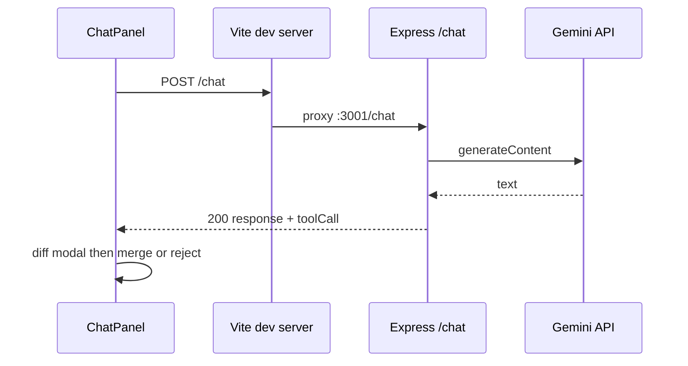

# Workspace documentation

Browser-based **JavaScript workspace** (Monaco editor, in-memory `.js` files), **Google Gemini** chat with optional **`edit_file`** / **`create_file`** proposals, and **sandboxed** server-side **Run** for the active file. Stack: **Express** (`server/`) + **Vite + React 19** (`client/`).

**Implementation history (append-only, factual):** [`agent-memory.md`](./agent-memory.md)

---

## Table of contents

1. [Overview](#1-overview)  
2. [Quick start](#2-quick-start)  
3. [Configuration](#3-configuration)  
4. [Using the application](#4-using-the-application)  
5. [API reference](#5-api-reference)  
6. [Project layout](#6-project-layout)  
7. [Build and deployment notes](#7-build-and-deployment-notes)  
8. [Security and limitations](#8-security-and-limitations)  
9. [Troubleshooting](#9-troubleshooting)  
10. [For contributors and AI assistants](#10-for-contributors-and-ai-assistants)

---

## 1. Overview

| Part | Path | Stack | Default URL |
|------|------|-------|----------------|
| API | `server/` | Node.js, Express, ESM, **vm2** for `POST /run` | http://localhost:3001 |
| UI | `client/` | React 19, Vite 6, Monaco, lucide-react | http://localhost:5173 |

**High-level behavior**

- **Explorer + Monaco:** Cursor-inspired dark UI; virtual files live only in React state (no disk persistence).
- **AI chat:** Sends workspace context to **`POST /chat`**; model may return structured **`edit_file`** / **`create_file`** → diff modal → accept/reject.
- **Run:** Sends active **`.js`** buffer to **`POST /run`**; output and errors shown under the editor (panel can be minimized).

**Gemini:** `@google/generative-ai`, model name in **`MODEL_NAME`** inside `server/services/geminiService.js` (e.g. **`gemini-2.5-flash`**). API key: **`GEMINI_API_KEY`**.

---

## 2. Quick start

**Prerequisites:** Node.js **18+** recommended.

From the **repository root**:

```powershell
npm run install:all
```

Copy **`server/.env.example`** → **`server/.env`** and set **`GEMINI_API_KEY`**.

**Run both apps:**

```powershell
npm run dev
```

- UI: http://localhost:5173  
- API: http://localhost:3001  
- In dev, the UI calls **`/api/*`**, **`/chat`**, **`/run`** on the Vite origin; **`client/vite.config.js`** proxies those to Express.

**API only or UI only:**

```powershell
npm run dev:server
npm run dev:client
```

---

## 3. Configuration

Set variables in **`server/.env`** or the process environment. **`server/index.js`** imports **`./env.js`** first so `.env` is loaded before other server modules (including run timeout).

| Variable | Default | Purpose |
|----------|---------|---------|
| `PORT` | `3001` | API listen port |
| `CLIENT_ORIGIN` | `http://localhost:5173` | CORS allowed origin |
| `GEMINI_API_KEY` | _(required for chat)_ | Gemini API key |
| `RUN_VM_TIMEOUT_MS` | `1000` | `POST /run` wall-clock timeout (ms), clamped **1–60000**; read when `runCode.js` loads (**restart** after change) |

**Tracked template:** `server/.env.example` (never commit real secrets).

---

## 4. Using the application

### 4.1 Virtual workspace (JavaScript-only)

- Explorer tabs are **only** `*.js` single-segment names (e.g. `main.js`, `untitled-1.js`). This is **not** the same as repo UI files (those may use `.jsx` for React).
- **New file:** `untitled-N.js` with starter `// New file\n`.
- **Rename:** Edit the **base name** only; a fixed **`.js`** suffix is shown; any typed extension is normalized away.
- **Delete / Undo / Redo:** As in the workspace table below; **reload** resets to **`main.js`** only.

### 4.2 Editor and Run

- Monaco language mode is **JavaScript** for valid workspace paths.
- **Run** (header): posts current file text to **`POST /run`**; **Output** shows captured **`console.*`** and errors. **Output** can be **minimized** with the header chevron; **Run** re-expands the panel.

### 4.3 AI chat and file proposals

- Composer sends **`message`**, full **`files`** map, and **`currentFile`** to **`POST /chat`**.
- Valid tool payloads open **`AiEditPreviewModal`** (Monaco diff). **Accept** updates `files`, **`activePath`**, **`editorNonce`**, and shows a toast. **Reject** / **Escape** discards.

### 4.4 Workspace state (reference)

| Topic | Behavior |
|-------|----------|
| Storage | `useState` in `App.jsx`: `files` is `{ [filename: string]: string }`. |
| Create | Next free `untitled-N.js`. |
| Select | Sets `activePath`; explorer uses `aria-current` on active row. |
| Delete | Confirm → remove key; pick next active or `null`; bump `editorNonce` if needed. |
| Rename | Validators ensure `.js`, no dupes; `handleRenameFile` / `FileExplorer` use `workspaceFileValidation.js`. |
| Editor | `value` = `files[activePath]`; `onChange` writes back live. |
| Remount | `CodeEditor` `key` includes `editorNonce` after structural changes. |
| Undo / redo | Max **40** snapshots per stack; `{ files, activePath }` shallow clone; typing burst groups one undo entry; redo cleared on new capture. |

Chat request flow:



---

## 5. API reference

### 5.1 Route index

| Method | Path | Success body (shape) |
|--------|------|----------------------|
| GET | `/api/health` | `{ ok, service, timestamp }` |
| GET | `/api/hello` | `{ message }` |
| POST | `/chat` | `{ response: string, toolCall: null \| { action, filename, content } }` |
| POST | `/run` | `{ output: string, error: string }` |

### 5.2 `POST /chat`

- **URLs:** `http://localhost:5173/chat` (proxied) or `http://localhost:3001/chat`
- **Headers:** `Content-Type: application/json` (body limit **4 MB**)
- **Body:** `message` (string, required). Optional `files` (≤200 keys, string→string), `currentFile` (string or null). Every **`files`** key and non-null **`currentFile`** must be a valid **`*.js`** workspace name (`parseChatContext` + `workspaceFileValidation.js`).
- **200:** `response` (may be `""` if only a tool JSON), `toolCall` validated tool or `null`.
- **Tool JSON:** Parsed from model output by `assistantOutput.js`. Rejected non-`.js` filenames yield plain-text `response` and `toolCall: null`.
- **Errors:** JSON with `error` and usually `detail`; typical statuses **400**, **401/403**, **429**, **500**, **502** (see prior README behavior — missing key, rate limits, upstream failures).

### 5.3 `POST /run`

- **URLs:** `http://localhost:5173/run` (proxied) or `http://localhost:3001/run`
- **Body:** `{ "code": string }` — max **`MAX_RUN_CODE_CHARS`** (500 000 in `runCode.js`).
- **200:** `{ output, error }`. Code runs in **`vm2`** `VM` with **only** stub **`console`**; no **`require`**, **`process`**, **`fs`**, or network in the sandbox; **`eval: false`**, **`wasm: false`**, **`allowAsync: false`**; **`bufferAllocLimit`** 1 MiB; timeout **`RUN_TIMEOUT_MS`** (default **1000** ms).
- **400 / 500:** Documented `{ output, error }` shapes where applicable.

---

## 6. Project layout

```
.
├── agent-memory.md       # Append-only implementation changelog (see top of README)
├── package.json
├── README.md
├── server/
│   ├── index.js
│   ├── env.js
│   ├── chatBody.js
│   ├── assistantOutput.js
│   ├── workspaceFilename.js
│   ├── workspaceFileValidation.js
│   ├── runCode.js
│   ├── .env.example
│   └── services/
│       └── geminiService.js
└── client/
    ├── vite.config.js
    ├── index.html
    ├── public/favicon.svg
    └── src/
        ├── main.jsx
        ├── App.jsx
        ├── App.css
        ├── index.css
        ├── workspaceFilename.js
        ├── workspaceFileValidation.js
        └── components/
            ├── FileExplorer.jsx
            ├── CodeEditor.jsx
            ├── ChatPanel.jsx
            └── AiEditPreviewModal.jsx
```

**Key client files**

| File | Role |
|------|------|
| `App.jsx` | Workspace, undo/redo, Run/output, AI diff + toast, validation hooks |
| `workspaceFilename.js` / `workspaceFileValidation.js` | Path policy and validators |
| `FileExplorer.jsx` | List, new file, rename (with `.js` suffix UI), delete, context menu |
| `CodeEditor.jsx` | Monaco instance |
| `ChatPanel.jsx` | Thread + `POST /chat` |
| `AiEditPreviewModal.jsx` | Diff editor + accept/reject |

**Notable client deps:** `lucide-react`, `@monaco-editor/react`, `monaco-editor`, `vite-plugin-monaco-editor` (Monaco workers; use `default` export interop in `vite.config.js`).

---

## 7. Build and deployment notes

**Client build (from `client/` or root per your scripts):**

```powershell
npm run build
```

Output: **`client/dist/`**, including **`monacoeditorwork/`** for workers — deploy with same relative URL layout as `index.html`.

**API production:** `npm start` in `server/` runs `index.js` (no watch). Serving **`client/dist`** from Express is **not** wired in this repo yet.

**Vite preview / static hosting:** Proxy **`/chat`** and **`/run`** to the API, or use absolute API URLs — the client uses relative **`/chat`** and **`/run`**.

**Layout tokens:** Explorer width `--width-explorer` (244px), chat `--width-chat` (384px). **Accessibility:** chat log `role="log"`, `aria-live="polite"`; hidden label on chat input.

---

## 8. Security and limitations

- **`vm2` is unmaintained**; sandbox settings reduce accidental Node access and dynamic code paths but are **not** a guarantee against determined attackers. Use separate processes/containers for hostile or production execution.
- **Workspace data** is in-memory only unless you add persistence.
- **Gemini** key must stay out of git; use **`server/.env`**.

---

## 9. Troubleshooting

| Symptom | Likely cause |
|---------|----------------|
| “Could not reach API” / fetch errors | API down or wrong port / proxy |
| CORS errors | `CLIENT_ORIGIN` mismatch with actual UI origin |
| `npm run dev` fails | Run `npm run install:all` from root |
| `POST /chat` 500 “Server configuration” | Missing `GEMINI_API_KEY` |
| `POST /chat` 401/403 | Bad or disabled API key |
| `POST /chat` 400 “files” | Invalid `files` / `currentFile` or non-`*.js` keys |
| `POST /run` 400 | Bad `code` type or over max length |
| `POST /run` timeout message | Exceeded `RUN_TIMEOUT_MS` — shorten sync work or raise `RUN_VM_TIMEOUT_MS` and restart |
| `POST /run` async / eval issues | `allowAsync: false`, `eval: false` — use simple synchronous scripts |
| Run disabled | No active `.js` tab |
| Rename blocked | Invalid base name, separators, or duplicate after normalization |
| Output “gone” | Output panel minimized — expand via chevron or Run |
| Monaco workers 404 in prod | Ship `monacoeditorwork` with `dist` |
| Files vanish on refresh | Expected — in-memory workspace only |

---

## 10. For contributors and AI assistants

When requesting changes, specify: **which side** (`server` / `client` / both), **goal**, **API contract** (method, path, body, responses), **env** and secrets handling, **ports** (align CORS + Vite proxy), and any **Gemini** / **Monaco** constraints.

**Touch points by feature**

| Area | Typical files |
|------|----------------|
| Chat / Gemini | `server/services/geminiService.js`, `assistantOutput.js`, `chatBody.js`, `ChatPanel.jsx`, `App.jsx` |
| Workspace paths / validation | `workspaceFilename.js`, `workspaceFileValidation.js` (client + server), `FileExplorer.jsx`, `App.jsx` |
| Run sandbox | `server/runCode.js`, `server/index.js`, `client/vite.config.js`, `App.jsx`, `App.css` |
| UI / Monaco | `App.css`, `index.css`, `CodeEditor.jsx`, `vite.config.js`, `index.html`, `public/favicon.svg` |

Record **factual implementation changes** in [`agent-memory.md`](./agent-memory.md) (append-only).
