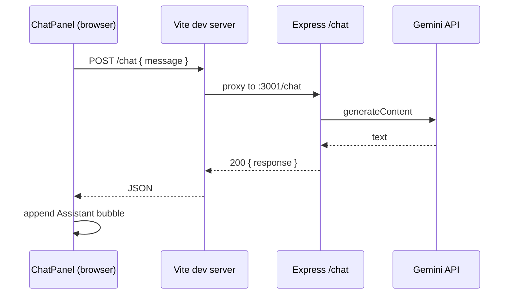

# Fullstack project (Express + Vite React)

This repo is a small **JavaScript** (no TypeScript) fullstack setup:

| Part   | Path      | Stack                          | Default URL              |
|--------|-----------|--------------------------------|--------------------------|
| API    | `server/` | Node.js, Express, ES modules  | http://localhost:3001    |
| UI     | `client/` | React 19, Vite 6, Monaco Editor | http://localhost:5173    |

**Frontend UI:** three-column **dark** workspace — **Explorer** (in-memory files, create + select), **Monaco** (content + language per file), **Chat** wired to **`POST /chat`** (see [Chat UI and backend](#chat-ui-and-backend) and [In-memory workspace files](#in-memory-workspace-files)).

**Google Gemini (server):** chat is implemented in `server/services/geminiService.js` using `@google/generative-ai` and model **`gemini-1.5-flash`**. The API key is read from **`GEMINI_API_KEY`** (never commit the real key).

---

## What I (the agent) need for future tasks

When you ask for changes, it helps to specify:

1. **Which side** — `server`, `client`, or both.
2. **Goal** — feature, bug, refactor, or deployment target.
3. **API contract** — if adding endpoints: method, path, request/response shape, auth.
4. **Env** — Node version if not default LTS; any secrets via `.env` (never commit real secrets).
5. **Ports** — if you change `3001` / `5173`, say so (CORS + Vite proxy must stay aligned).
6. **Gemini** — for chat or model changes: confirm `GEMINI_API_KEY` in the server environment and desired model name (default `gemini-1.5-flash` in `server/services/geminiService.js`).
7. **Monaco / layout** — if changing the editor: `client/src/components/CodeEditor.jsx`, `vite.config.js` (Monaco plugin), and `App.css` (pane widths `--width-explorer`, `--width-chat`).
8. **Virtual files** — state lives in `App.jsx` (`workspace.files` map); no persistence unless you add it.

---

## Prerequisites

- **Node.js** 18+ recommended (Express + Vite 6; `--watch` on the server needs a recent Node).

---

## First-time setup

From the **repository root** (`llm/`):

```powershell
npm install
npm install --prefix server
npm install --prefix client
```

Or one shot:

```powershell
npm run install:all
```

**Gemini API key (local file):** copy `server/.env.example` to **`server/.env`**, then set `GEMINI_API_KEY=` to your key. **`server/.env` is gitignored** (see repo root `.gitignore`). The server loads it automatically via **`server/env.js`** and **`dotenv`** on startup (path is always next to `index.js`, regardless of current working directory).

---

## Development (both apps)

From the **repository root**:

```powershell
npm run dev
```

This runs **Express** and **Vite** together via `concurrently`.

- Open the UI: http://localhost:5173  
- API base (direct): http://localhost:3001  
- In dev, the browser can call **`/api/...`** and **`POST /chat`** on the Vite dev server; Vite **proxies** those paths to Express (see `client/vite.config.js`).

**Gemini:** set `GEMINI_API_KEY` in **`server/.env`** (see [Environment variables](#environment-variables)) or in the shell before `npm run dev` / `npm run dev:server`.

**Explorer / editor:** use **New file** to add `untitled-N.js` entries. Click a file to open it in Monaco; edits update **`workspace.files[path]`** in React state immediately (no disk, no DB). Refreshing the page resets to the default **`main.js`** starter.

**Chat in the UI:** the right panel is a **threaded chat** — **You** vs **Assistant** bubbles; each send is **`POST /chat`** with `{ "message": string }`. Run **`npm run dev`** so Vite proxies `/chat` to Express and set **`GEMINI_API_KEY`** in **`server/.env`**.

### Run one side only

```powershell
npm run dev:server
npm run dev:client
```

---

## Production-ish flow

1. Build the client:

   ```powershell
   npm run build
   ```

   Output: `client/dist/`

2. Start the API (no hot reload):

   ```powershell
   npm start
   ```

Serving the built SPA from Express is **not** wired yet; say if you want `express.static` for `client/dist` and a catch-all for SPA routing.

**Monaco production build:** `npm run build` emits worker bundles under **`client/dist/monacoeditorwork/`** (path controlled by `vite-plugin-monaco-editor`). If you deploy only `client/dist`, include that folder and keep the same URL structure relative to `index.html`.

---

## Frontend (client)

| Piece | Role |
|--------|------|
| `src/App.jsx` | Workspace shell; **`workspace`** state: `{ files: Record<path, string>, activePath }` — create/select/edit all update this object in memory |
| `src/components/FileExplorer.jsx` | Lists `paths`, **New file** button, file buttons with `aria-current` for selection |
| `src/components/CodeEditor.jsx` | **Monaco** — `key={path}` remounts per file; `language` from extension (`.js`, `.json`, `.css`, …) |
| `src/components/ChatPanel.jsx` | Chat thread: **`fetch("/chat", { method: "POST", headers: { "Content-Type": "application/json" }, body: JSON.stringify({ message }) })`** → append user bubble, then assistant bubble from **`data.response`**, or an **Error** row on failure |

### Chat UI and backend



| Step | Detail |
|------|--------|
| 1 | User submits text; UI immediately shows a **You** message. |
| 2 | `POST /chat` with body **`{ "message": "<trimmed text>" }`**. |
| 3 | On **200**, UI reads **`response`** (string) and shows **Assistant**. |
| 4 | On error (non-OK or network), UI shows **Error** with `detail` / `error` from JSON when present. |
| 5 | In dev, **`client/vite.config.js`** proxies **`/chat`** → `http://localhost:3001/chat` (same path). |

**Styles:** `src/App.css` (workspace + chat turns/bubbles), `src/index.css` (theme tokens).

**Dependencies (notable):**

- `@monaco-editor/react` — React wrapper for Monaco
- `monaco-editor` — editor engine (peer to the wrapper)
- `vite-plugin-monaco-editor` (**devDependency**) — wires Monaco workers for Vite; in `vite.config.js` the plugin is loaded with **`monacoEditorModule.default ?? monacoEditorModule`** because the package is CJS and Vite’s ESM interop may not expose `default` as a callable.

**Production note:** `vite preview` or a static host must proxy **`/chat`** to your API or use a full API URL — the code uses a **relative** `/chat` URL.

**Layout:** fixed left width (`--width-explorer`: 232px), flexible center editor, fixed right width (`--width-chat`: 340px), full viewport height. **Accessibility:** chat input has a visually hidden label; message list uses `role="log"` / `aria-live="polite"`.

### In-memory workspace files

| Concept | Implementation |
|---------|----------------|
| Storage | `useState` in **`src/App.jsx`**: `files` is a plain object **`{ [filename]: string }`**. |
| Create | **New file** → next free name `untitled-1.js`, `untitled-2.js`, … with starter body `// New file\n`. |
| Select | Clicking a file sets **`activePath`**; explorer highlights the active file (`aria-current="true"`). |
| Editor | Monaco **`value`** is **`files[activePath]`**; **`onChange`** writes back into **`files[activePath]`** (live “save” in RAM). |
| Language | **`languageFromFilename()`** in `App.jsx` maps extension → Monaco language (unknown → `plaintext`). |
| Remount | **`CodeEditor`** passes **`key={path}`** to Monaco so each file gets a clean editor instance when switching. |

Data is **not** sent to the server unless you add that later; **reload** restores only **`DEFAULT_FILES`** (`main.js`).

---

## Environment variables

Values can be set in **`server/.env`** (recommended for local dev) or in the process environment (CI/production).

| Variable          | Where   | Default                 | Purpose                                      |
|-------------------|---------|-------------------------|----------------------------------------------|
| `PORT`            | server  | `3001`                  | API listen port                              |
| `CLIENT_ORIGIN`   | server  | `http://localhost:5173` | CORS allowed origin                          |
| `GEMINI_API_KEY`  | server  | _(see `server/.env`)_   | Google AI Studio / Gemini API key            |

**Files:**

| File | Git | Purpose |
|------|-----|--------|
| `server/.env` | **Ignored** — never commit | Your real `GEMINI_API_KEY` and optional overrides |
| `server/.env.example` | Tracked | Template; copy to `.env` and fill in |

**Loading:** `server/index.js` imports **`./env.js` first**; `env.js` calls `dotenv.config({ path: join(__dirname, ".env") })` so **`server/.env`** is always read from the server package directory.

Example (PowerShell) without a `.env` file — still works for one-off runs:

```powershell
$env:PORT = "4000"; $env:CLIENT_ORIGIN = "http://localhost:5173"; npm run dev:server
```

```powershell
$env:GEMINI_API_KEY = "<your-key>"; npm run dev:server
```

If you change the Vite port, set `CLIENT_ORIGIN` in `server/.env` (or the shell) to match.

---

## API routes (current)

| Method | Path           | Response example                                      |
|--------|----------------|-------------------------------------------------------|
| GET    | `/api/health`  | `{ "ok": true, "service": "express", "timestamp": … }` |
| GET    | `/api/hello`   | `{ "message": "Hello from the Express API" }`       |
| POST   | `/chat`        | Success: `{ "response": "<model text>" }` — see below |

### `POST /chat` (Gemini)

- **URL (via Vite dev server):** `http://localhost:5173/chat` (proxied to Express).  
- **URL (direct to API):** `http://localhost:3001/chat`
- **Headers:** `Content-Type: application/json`
- **Body:** `{ "message": "<string>" }` — `message` must be a non-empty string after trimming.
- **Success (200):** `{ "response": "<string>" }` — assistant text only.

**Error responses (JSON):** failures return an object with at least `error` and usually `detail` (human-readable). Status codes include:

| Status | When |
|--------|------|
| `400`  | Missing/invalid `message` in body |
| `401` / `403` | Upstream rejected the key or permission (mapped from Gemini client when detectable) |
| `429`  | Rate limited by Gemini |
| `500`  | Missing `GEMINI_API_KEY`, or unexpected server error |
| `502`  | Upstream Gemini failure / empty model output when not classified otherwise |

The Express app uses **`express.json()`**, **CORS** (`CLIENT_ORIGIN`), and delegates generation to **`generateResponse(message)`** in `server/services/geminiService.js` (`@google/generative-ai`, model **`gemini-1.5-flash`**).

---

## Folder layout

```
.
├── package.json          # root scripts + concurrently
├── README.md             # this file
├── server/
│   ├── package.json
│   ├── index.js          # Express entry (imports env.js first)
│   ├── env.js            # Loads server/.env via dotenv
│   ├── .env.example      # Template for secrets (copy to .env)
│   └── services/
│       └── geminiService.js   # generateResponse(message) → Gemini text
└── client/
    ├── package.json
    ├── vite.config.js
    ├── index.html
    └── src/
        ├── main.jsx
        ├── App.jsx
        ├── App.css
        ├── index.css
        └── components/
            ├── FileExplorer.jsx
            ├── CodeEditor.jsx
            └── ChatPanel.jsx
```

---

## Notes for agents / maintainers

- **Language:** `.js` / `.jsx` only; no `tsconfig` or TS deps by design.
- **Server module format:** `server/package.json` has `"type": "module"` — use `import`/`export` in server code.
- **Server secrets:** use **`server/.env`** (gitignored). **`server/.env.example`** is the committed template.
- **Virtual workspace files:** in-memory map + `activePath` in **`client/src/App.jsx`**; not persisted (refresh resets to `main.js` only).
- **CORS:** Restricted to `CLIENT_ORIGIN` in dev; extend or use a list if you add more origins.
- **Proxy:** During `vite` dev, `/api` and `/chat` are proxied to the Express port (`client/vite.config.js`).
- **Monaco:** `vite.config.js` registers `vite-plugin-monaco-editor` **after** `@vitejs/plugin-react` so workers build and copy to `dist/monacoeditorwork/` on production builds.

---

## Troubleshooting

| Symptom                         | Likely cause                                      |
|---------------------------------|---------------------------------------------------|
| UI shows “Could not reach API” | Server not running, or wrong proxy/port          |
| CORS errors in browser          | `CLIENT_ORIGIN` does not match actual Vite URL   |
| `npm run dev` fails             | Run `npm run install:all` from root first        |
| `POST /chat` → 500 “Server configuration error” | `GEMINI_API_KEY` missing — add it to **`server/.env`** or the shell environment |
| `POST /chat` → 401/403 from API | Invalid or revoked API key, or API not enabled for the project |
| `POST /chat` → 429 | Gemini rate limit; retry later |
| Monaco workers 404 after deploy | Ensure `monacoeditorwork` from `client/dist` is deployed next to assets / same base path |
| `monacoEditorPlugin is not a function` (build) | Use `default` export from `vite-plugin-monaco-editor` in `vite.config.js` (already applied in this repo) |
| Created files vanish on refresh | Expected: virtual files live only in React state; add persistence if you need it |
